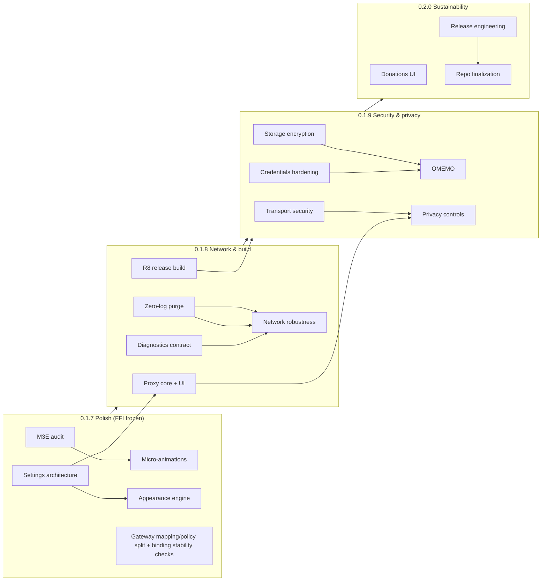

# MindChat Roadmap

This document is the single source of truth for MindChat's direction from
0.1.7 through 0.2.0. It replaces `PLAN.md` and `STATUS.md`, which were folded
into this roadmap, `CHANGELOG.md`, `CONTRIBUTING.md`, and the code itself.
Git history preserves everything that was removed.

- Current release: **0.1.6** (`v0.1.6`, versionCode 6)
- Target: **0.2.0**
- Repository: <https://github.com/emptinens/mindchat>

---

## 1. Product contract

MindChat is a private, open-source XMPP messenger for Android. The contract
is short and non-negotiable:

1. **The user owns the network path.** MindChat operates no servers, has no
   cloud account, and talks only to the XMPP server the user configures.
2. **Zero logs, zero telemetry.** No logging statements, no analytics, no
   crash reporting, no diagnostics that leave the device. Enforced by a CI
   gate, not by discipline.
3. **Minimal auditable dependencies.** New crates only when already in the
   offline Cargo cache or vendored deliberately. Every dependency must be
   justified in the commit.
4. **Material 3 Expressive only.** No legacy Material widgets, icons-core
   only, no material-icons-extended.
5. **English/Russian parity 1:1.** Every UI string exists in both
   `values/strings.xml` and `values-ru/strings.xml`; missing parity is a
   merge blocker.
6. **One FFI contract, regenerated, never hand-edited.** Bindings come from
   `scripts/generate-uniffi-kotlin.sh`; Preview and Native gateways share
   decision logic in pure Kotlin files (`GatewayInput.kt` pattern).
7. **No UI without a core model.** A toggle the user can flip must be backed
   by the FFI snapshot, `MindChatPreferences`, or `AccountProfile`, never by
   Compose-local state that pretends persistence.

## 2. Release identity

| Item | Value | File |
| --- | --- | --- |
| Android versionName | `0.1.6` (bump per release) | `app/build.gradle.kts` |
| Android versionCode | `6` (monotonic) | `app/build.gradle.kts` |
| Rust crate version | `0.1.4` (**drifted; re-sync at 0.2.0**) | `crates/mindchat-core/Cargo.toml` |
| App ID | `com.mindchat.app` | `app/build.gradle.kts` |
| Min / target SDK | 26 / 36 | `app/build.gradle.kts` |
| UniFFI | 0.32.0 (pinned, never upgraded casually) | `crates/mindchat-core/Cargo.toml` + `scripts/generate-uniffi-kotlin.sh` |
| License | Apache-2.0 | `LICENSE` |

Policy: bump the crate version **iff the FFI surface changes**; bump
`BuildConfig.EXPECTED_BINDING_VERSION` in the same commit. At 0.2.0 the
drifted crate version re-syncs to the app version.

## 3. Cross-cutting rules (bind all releases)

### 3.1 FFI surface policy

- **0.1.7 and 0.2.0: frozen surface.** Zero FFI changes; the whole release
  is Android-local or tooling.
- **0.1.8 and 0.1.9: additive only.** New enum variants and record fields
  are allowed in lockstep with regeneration; removal, rename, or reorder is
  a major contract change and requires a migration note.
- Introduce in 0.1.7 and keep forever:
  - `scripts/check-ffi-stability.sh`: regenerate bindings into a temp dir,
    extract signatures, diff against a committed golden snapshot
    (`scripts/binding-api.golden`). CI runs it; `--update` for intentional
    changes.
  - Version probe assert: `NativeMindChatGateway` asserts
    `mindchat_binding_version()` equals `BuildConfig.EXPECTED_BINDING_VERSION`
    in release builds. A silent ABI mismatch becomes a loud startup failure.
- Every FFI change ships with `bridge_*` handle tests in `ffi.rs`.

### 3.2 Shared decision logic

Every decision that can differ between Native and Preview, or that derives
UI-visible values from snapshot/input data, is a pure function in a
gateway-shared file. Both gateways call the same function; neither
implements the rule inline.

- `GatewayInput.kt`: input validation/normalization (existing).
- `GatewayMapping.kt`: new in 0.1.7; `mapSnapshotToUiState` and
  `shouldSkipUiRebuild` move here (top-level pure functions already).
- `GatewayPolicy.kt`: new in 0.1.7; state-transition and fallback rules
  (`nextActiveAccountId`, stall thresholds, backoff display, trust mapping).

All three files stay `internal`, dependency-free (no Android imports, no
`Context`, no `SharedPreferences`), with injected time. Review gate: no new
`if`/`when` on snapshot-derived values inside gateway implementations.

### 3.3 Coordination rules

- **One owner per file.** `ffi.rs`, `xmpp.rs`, `MindChatGateway.kt`,
  `SettingsScreen.kt`, `theme/` have a single owner per release; parallel
  tracks propose via shared files and contract-first PRs.
- **Contract-first PRs.** A feature PR touching a shared gateway file or the
  FFI surface is a pure contract PR (types + tests, no UI), merged before
  its UI PR.
- **Preview parity.** Every new `MindChatUiState` field appears in
  `seedState()` and is exercised by a contract test driving both gateways to
  identical outputs. A Preview that cannot reproduce a Native decision is a
  bug.

### 3.4 Zero-log gate

`scripts/check-zero-log.sh` scans `git ls-files` for logging emission
patterns (`println!`, `eprintln!`, `log::`, `tracing::`, `android.util.Log`,
`System.out/err`, `Timber`, zip producers) and verifies `cargo tree` shows
`max_level_off` + `release_max_level_off` unified into the `log` and
`tracing` crates. Runs as its own CI job. Debugging happens through typed
errors, unit tests, `RUST_BACKTRACE=1` panics, and the gated live suite,
never through runtime logging.

### 3.5 Release gates (every release)

Rust: `cargo fmt --check`, `cargo clippy --workspace --all-targets -- -D
warnings`, `cargo test --workspace --all-features`, `cargo test --workspace
--no-default-features`, gated live suite (`MINDCHAT_LIVE_TESTS=1`).
Android: `compileDebugKotlin`, `testDebugUnitTest`, `lintDebug`,
`compileDebugAndroidTestKotlin`, `assembleDebug` (+ `assembleRelease` and
`lintVitalRelease` from 0.1.8). Plus: zero-log gate, EN/RU parity check,
M3E-only import scan, contract tests through `MindChatGateway`.

## 4. Sequencing map

Hard sequencing rules:

1. **Storage encryption (0.1.9 phase A) blocks OMEMO (phase B).** OMEMO key
   material never rides in the plaintext JSON snapshot.
2. **R8 (0.1.8) precedes OMEMO (0.1.9).** R8 + UniFFI problems are cheap in
   0.1.8 and catastrophic mid-crypto.
3. **Settings architecture gates the appearance engine in merge order.**
   The M3E audit merges before any micro-animation work.
4. **Diagnostics contract (0.1.8) precedes network robustness.** Backoff
   work without a diagnostics surface is unverifiable in the field.
5. **Proxy (0.1.8) precedes privacy controls (0.1.9).** Privacy controls
   never implement their own networking.
6. **Repo finalization is 0.2.0, after a feature freeze.** Do not restructure
   during 0.1.9.

## 5. Release 0.1.7: Polish and customization foundation

Character: Android-local polish, settings architecture, appearance engine.
**FFI frozen.** No new dependencies.

### 5.1 M3E audit backlog (`theme/`, `MindChatApp.kt`)

Verified against material3 1.4.0. P0 (must land):

- **Motion tokens:** new `theme/Motion.kt` defining `MindChatMotionScheme`
  (`MotionScheme.fromToken`), wired via `MaterialTheme.motionScheme`; use
  `MotionSchemeKeyTokens.FastEffects`/`SlowEffects`/spatial tokens for dock
  pill and other animated affordances instead of tween literals.
- **Semantic status colors:** `MindChatStatusColors(online, away, failed,
  onOnline, onAway, onFailed)` with WCAG-AA light/dark values, replacing the
  duplicated `Color(0x...)` literals in `connectionDotColor` and
  `PresenceDot`.
- **Icon replacements:** `Text("🔒")` → `Icon(Icons.Filled.Lock)` at
  `MindChatApp.kt:744`; `Text("↑")` → `Icon(Icons.Filled.Send)` at
  `MindChatApp.kt:929` (both in icons-core); add `send` string EN/RU.
- **Dialog theming:** `shape = MaterialTheme.shapes.extraLarge` on the three
  `AlertDialog` calls missing it (`AddContactDialog`,
  clear-images and licenses dialogs in `SettingsScreen.kt`).

P1 (ship if time-box allows, else documented deferral):

- Opt-in `MaterialExpressiveTheme(...)` (B5) with `@OptIn`; fall back to B1
  motion wiring on plain `MaterialTheme` if regression risk is real.
- Snackbar host (B6): hoisted `SnackbarHostState` on both Scaffolds;
  transient results (deletes, profile saved, connection error).
- Expressive FAB (B7): `ExtendedFloatingActionButton` for the Chats
  destination hero action.
- Dock shape/motion tokenization (B8): move 28dp/20dp dock shapes into
  `theme/Shape.kt`; apply `defaultEffectsSpec` to the pill animation.
- Tokenized chat-bubble shape (B9): `MindChatBubbleShape(mine: Boolean)` in
  `theme/Shape.kt`.
- Expressive empty states (B10): tonal medallion + icon above headline.
- Pull-to-refresh (B11) on conversations and contacts lists.
- Swipe-to-dismiss (B12) for conversation delete, keeping the confirm dialog
  and adding snackbar undo.
- Broader tonal accent schemes (B13): derive secondary/tertiary/neutral
  families from the seed. `ColorScheme.fromSeed` is **not** available in
  material3 1.4.0; KDoc must note the migration path to 1.5.

### 5.2 Settings architecture (`SettingsSchema.kt`, `SettingsNavigation.kt`, `SettingsScreen.kt`)

- **Typed keys.** `SettingKey<T>` carries type, default, category, scope,
  availability (`IMPLEMENTED | PENDING_CORE`), storage key, EN/RU label
  resources, search keywords. Raw string keys are rejected. `SettingsSchema`
  enumerates all keys; `SettingsSnapshot` (map-backed, immutable) replaces
  the three booleans on `MindChatUiState`.
- **Zero migration.** `storageKey` for the four existing settings
  (`dynamic_color`, `comfortable_layout`, `app_lock_enabled`, search,
  encryption toggles) equals today's SharedPreferences keys exactly. New
  keys are new names; deleted keys are never reused.
- **Secrets never get a SettingKey.** Schema is device-local non-secret
  configuration only.
- **Pure derivations in `GatewayInput.kt`:** `settingKeyFor`,
  `sanitizeSetting`, `settingsChanged`, `catalogRows` (UI row derivation),
  `searchSettings`. Named toggle methods stay as thin wrappers so existing
  contract tests keep working.
- **Navigation:** dependency-free `SettingsNavState` state machine
  (`root -> category -> per-account`), JVM-testable. No navigation library.
- **Additive proof:** adding a 0.1.8/0.1.9 setting = new key + strings +
  optional gateway method; `catalogRows` renders it. Never rework.

### 5.3 Appearance engine (`Appearance.kt`, `AppearanceScreen.kt`)

- **Data model:** `AppearanceProfile` nested as one field inside
  `MindChatCustomization` (persistence stays atomic, diffing stays a single
  comparison). `AccountProfile` gains two nullable overrides
  (`bubbleStyle`, `chatBackground`) beside the existing `accentKey`.
- **Global dimensions:** shape scale (COMPACT/STANDARD/EXPRESSIVE), density
  (replaces `comfortableLayout` with legacy-bool migration), text scale,
  animation speed (via `LocalMotionDurationScale`).
- **Per-account dimensions:** chat personality only (bubble style, chat
  background); full per-account profiles rejected (merge ambiguity).
- **Defaults reproduce 0.1.6 exactly** on a fresh install.
- **Merge logic:** one pure `resolveAppearance(global, profile)` in
  `Appearance.kt` (the appearance twin of the `GatewayInput.kt` pattern).
- **Live preview:** global appearance applies immediately; per-account
  overrides keep the ProfileSheet Save pattern.
- No Rust/FFI changes; ~30 new tests across 4 suites; contract pinned via
  `PreviewMindChatGateway`.

### 5.4 Micro-animations (`theme/Motion.kt`, `MindChatApp.kt`)

- **T1 (P0):** motion token layer + `LocalReduceMotion` plumbing with a
  `Settings.Global` fallback. All later tasks degrade to fade-or-instant
  under reduce-motion.
- **T2-T4 (P1):** message send/arrival entrance (per-conversation seen-id
  sets + `AnimatedVisibility`/`animateItem`), delivery-label crossfade,
  unread badge scale-in, reaction chip pop. All state-delta driven, zero
  gateway changes.
- **T5-T6 (P2):** dock icon/weight motion, destination `AnimatedContent`
  fade+slide.
- **T7-T9 (P3):** 3 haptic sites, snackbar host wired to FAILED-delivery
  transitions (no new strings), connection/presence dot color crossfades.
- **Cut list when time-box tightens:** T5 Tier B (shared sliding pill),
  auto-scroll-on-arrival, avatar crossfade.
- **Do not animate:** infinite loops, bubble bounce, shimmer/skeletons,
  rolling badge digits, dialog re-animation, haptics on destructive actions.

### 5.5 Performance P0 (`MindChatGateway.kt`, `MindChatApp.kt`)

- **P0-1 Background poll gating:** pause the 750ms poll loop below
  `ON_START`; resume with one immediate poll on `ON_START`. Instrumentation
  assert: no FFI call while stopped (counter on a fake gateway).
- **P0-2 Timestamp formatting cache:** single `DateTimeFormatter` per locale
  instead of per-message `DateFormat` factory; output pinned by
  `SnapshotMappingTest`.
- **P0-3 Measurement harness:** `SnapshotMappingBenchmarkTest` (JVM) with
  1k/10k/50k fixtures; CI-safe budgets (unchanged poll < 200µs at 10k,
  mapping < 50ms at 10k as tripwires).
- **P0-4 Single-snapshot poll path:** a changed poll captures
  `core.snapshot()` once instead of up to three times; `PersistenceStateTracker`
  contract pinned by its test.

### 5.6 Housekeeping

- Split `MindChatGateway.kt` pure functions into `GatewayMapping.kt` and
  `GatewayPolicy.kt` (section 3.2) so 0.1.8/0.1.9 additions land in stable
  homes.
- Introduce `scripts/check-ffi-stability.sh` + golden
  `scripts/binding-api.golden` while the surface is frozen.
- Extract the hard-coded 35s stall threshold into a named shared constant.

### 5.7 Non-goals for 0.1.7

No FFI changes. No proxy, no OMEMO, no storage encryption, no R8, no new
dependencies. `ConversationUi.encrypted` stays a stub until 0.1.9 fills it
from real core state; an appearance-engine "encryption badge" that sets it
locally is forbidden.

### 5.8 DoD 0.1.7

- Zero FFI changes; `check-ffi-stability.sh` introduced and green.
- Settings migration-free (byte-identical legacy prefs keys);
  `SettingsSnapshot` diffing pinned in `SnapshotDiffingTest`.
- Appearance defaults reproduce 0.1.6; `resolveAppearance` pure-function
  tests + gateway contract tests green.
- M3E audit items P0 all landed; motion tokens wired; icons-core only.
- Perf: background poll gated; benchmark harness green with recorded p50s.
- EN/RU 125+ parity 1:1; zero-log gate green; all section 3.5 gates pass.

## 6. Release 0.1.8: Network and build hardening

Character: zero-log purge, network robustness, proxy, R8 release build,
diagnostics contract. FFI additive only.

### 6.1 Zero-log purge (`vendor/tokio-xmpp`, `crates/mindchat-core`)

Audit results (verified at 0.1.6): Kotlin app, manifest, Gradle: clean.
Rust core `src/`: clean. The work is in the vendored tree:

- **P0: delete the raw-stanza capture path**
  (`vendor/tokio-xmpp/src/xmlstream/capture.rs` + call sites in
  `common.rs`). This is the only path that can serialize message bodies.
  Deletion, not gating: it must never be resurrectable by an env var.
- **P1: remove the remaining 82 `log::*` calls** in 9 vendor files
  (`stanzastream/*`, `connect/*`, `client/iq.rs`). Then fix
  `vendor/tokio-xmpp/Cargo.toml` (and `Cargo.toml.orig`): drop
  `tokio-rustls` feature `logging`, drop `xmpp-parsers` feature `log`,
  delete `[dependencies.log]` and `[dev-dependencies.env_logger]`.
- **P1: delete `vendor/tokio-xmpp/examples/`** (8 demo binaries that print
  JIDs and passwords).
- **P1: live tests:** remove `env_logger` init; replace 17 `eprintln!`
  sites with silent skips (failures speak through assert messages).
- **P1: compile-time kill switch:** add `log` and `tracing` as direct
  deps with `features = ["max_level_off", "release_max_level_off"]`.
  Feature unification compiles every transitive `log::*`/`tracing::*` macro
  (rustls, hickory) to nothing, debug and release.
- **P2: delete the vestigial `.gitignore` pattern**
  `mindchat-diagnostics-*.zip` (no producer exists in any commit).
- **New:** `scripts/check-zero-log.sh` + CI job; binary `strings` check on
  the shipped `.so` (`RECV`, `SEND `, `Attempting connection` must be
  absent). Record the vendor diff summary in `CONTRIBUTING.md`.

### 6.2 Network robustness (`xmpp.rs`, `vendor/tokio-xmpp/src/stanzastream`)

Audit findings: mid-session loss is **terminal** today (the worker breaks on
`Disconnected`, so the vendored XEP-0198 reconnector never runs; users must
re-enter passwords); stale "Online" up to ~10 minutes (300s/300s timeouts,
no app-level liveness); resolution takes one address and one SRV record.

- **P0-1 Jittered, budgeted reconnect with stream-management resume:**
  vendor patch adds full jitter (`base/2 + rand(base/2)`, 1s doubling to
  30s cap) and a total retry budget (~5 min); `xmpp.rs` continues polling
  `client.next()` on recoverable mid-session `Disconnected` instead of
  breaking; `auto_reconnect: bool` on `ConnectionRequest`/`Account`
  (non-secret, survives restore); user disconnect stays immediate;
  initial-connect invariant (Connecting → Online/Failed ≤30s) untouched.
  Tests: pure backoff-sequence generator (injectable RNG seed), pure
  reconnect-decision fn, duplicate-`Connected` idempotency, gated live test
  with a local TCP forwarder.
- **P0-2 Idle watchdog + keep-alive:** tuned `Timeouts` (read 90s,
  response 60s) at both connector sites; XEP-0199 ping every 45s in the
  worker loop; inbound-data watchdog forcing `Disconnected(recoverable)`
  when `now - last_inbound > 3 min`. Bounds stale-Online to ~3 minutes.
- **P0-3 Resolution quality:** `resolve_host` collects all addresses (cap 4
  per port); `srv_endpoint` sorts all SRV answers by priority then weight
  (RFC 2782), worker-cached `TokioResolver`; Happy Eyeballs-lite racing of
  v4/v6 candidates with 250ms head start inside the 10s per-attempt budget.
  Plain-endpoints-before-SRV ordering stays (0.1.4 rationale).
- **P1-1 Event batching + flush tuning:** Kotlin adaptive drain (up to 4
  batches of 128, cap 512 events/cycle); Rust `FLUSH_SEND_TIMEOUT` 10s→4s,
  `FLUSH_OUTBOX_MAX_BATCH` 32→16 (worst-case lock ~14s).
- **P1-2 DNS-over-HTTPS (optional, default off):** feature-gated
  `hickory-resolver` `https-ring`; first gate is `cargo check --offline`;
  user-configured endpoint only, never hard-coded to a third party.
  Deferred if the offline check fails.
- **P2-2 Proxy seam (contract only, consumed by 6.3):** `ConnectStrategy`
  enum (`Direct | HttpConnect | Socks5`); vendored
  `PreconnectedServerConnector` wrapping an already-established stream so
  TLS runs unchanged against the real hostname; proxy failure is a
  recoverable connection failure under the same budget.
- No new Android permissions; manifest unchanged (INTERNET only).

### 6.3 Proxy (`src/proxy.rs`, `ffi.rs`, `SettingsScreen.kt`, `ProxyCredentialStore.kt`)

- **Deps decision:** implement minimal SOCKS5 (RFC 1928/1929) + HTTP
  CONNECT clients in `crates/mindchat-core/src/proxy.rs` (~250 lines). No
  socks crate exists in the offline cache; hand-written beats an
  unfetchable, unauditable dependency. Only change: tokio gains the
  `io-util` feature. Fallback: use cached `base64 0.22.1` for Basic auth.
- **DNS is resolved at the proxy only** (SRV skipped in proxy mode to
  avoid leaks); proxy credentials are never persisted by the core and
  follow the account-password hand-off pattern until 0.1.9.
- **FFI (additive):** `FfiProxyKind { Socks5, HttpConnect }`,
  `FfiProxyConfig` (no password field), `FfiProxyProbe { ok, latency_ms,
  error }`; methods `set_account_proxies`, `account_proxies` (password
  always None), `test_proxy`, `connect_account_with_proxy` (with
  `proxy_password: Option<String>`); `connect_account` unchanged.
- **UI:** Settings "Connection" section with proxy library (add/edit/
  ping), per-account assignment from the account drawer overflow; latency
  chip from persisted `ProxyStatus`; `KeystoreProxyCredentialStore`
  (AES-256-GCM per id, no deprecated security-crypto); shared validation
  (`validateProxyConfig`, `ProxyLatencyBucket`) in `GatewayInput.kt`;
  `GatewayProxyContractTest` through the public gateway. No fake latency,
  no plaintext credentials.

### 6.4 Release build optimization (`app/build.gradle.kts`, `proguard-rules.pro`, `scripts/`)

Measured baseline (0.1.6 APK, 38.6MB): ~28.5MB stored native libs
(unstripped: 10.7MB arm64, 10.6MB x86_64, 7.2MB armeabi-v7a; JNA ships
legacy mips/x86 ABIs), ~9.3MB deflated DEX (minify off, 22.8MB raw),
merged androidx `baseline.prof` already applied via transitive
profileinstaller.

- R8 + resource shrinking on (`isMinifyEnabled = true`,
  `isShrinkResources = true`); `android.enableR8.fullMode=true`;
  `-Xmx4g` in `gradle.properties`.
- **Keep rules** (`proguard-rules.pro`, replacing the placeholder):
  `-keep class com.mindchat.core.** { *; }` (JNA resolves native symbols
  from interface method names; `Structure` fields read reflectively),
  JNA rules (`com.sun.jna.**`, `* implements com.sun.jna.Library`,
  Structure fields), nothing else. No blanket androidx keeps, no
  `-dontwarn` without a real warning. No `panic="abort"` (defeats
  UniFFI's FFI guard).
- **ABI filtering + splits:** `ndk.abiFilters` (arm64-v8a, armeabi-v7a,
  x86_64) kills JNA legacy ABIs; `splits.abi` produces per-ABI APKs plus a
  universal one.
- **Strip:** `scripts/build-rust-android.sh` strips only the staged
  jniLibs copy with `llvm-strip --strip-all` (exported `ffi_mindchat_core_*`
  survive via `.dynsym`; verified with `readelf`); `target/` artifacts stay
  unstripped. No `[profile.release] strip` (would break bindgen symbol
  reading on the host dylib).
- **Budgets (hard CI gates):** universal ≤33MB, arm64 ≤16.5MB, x86_64
  ≤16.5MB, armeabi-v7a ≤13.5MB. `scripts/verify-release.sh` asserts sizes,
  v2 signature, keep-rule audit (`mapping.txt`/`seeds.txt`/`usage.txt`,
  `FieldOrder` present in dex), exported-symbol count after strip, and
  writes `sha256sums.txt`.
- **Signing:** secret-driven `signingConfigs.release` from
  `MINDSIGN_*` env or `~/.gradle/gradle.properties`, referenced only when
  present (local builds stay unsigned or debug-signed as today);
  `apksigner --v1-signing-enabled false`; keystore never in repo or CI
  logs. Until a dedicated keystore exists, debug-cert signing continues
  with an explicit note.
- **CI:** verify.yml extended with `testReleaseUnitTest`,
  `lintVitalRelease`, `assembleRelease`; new `release.yml`
  (workflow_dispatch + tag push) with toolchain provisioning, signing from
  secrets, per-ABI artifacts, `sha256sums.txt`, and an x86_64 emulator
  smoke job (boot to MainActivity, `-b crash` empty).
- **Smoke:** release APK on arm64 device: settings, add/remove account,
  app-lock toggle, one real connect; no `UnsatisfiedLinkError`/
  `ClassNotFoundException`; crash logcat empty (system-level only, no app
  instrumentation).
- **App-specific baseline profiles deferred to 0.1.9** (must be generated
  from the minified release variant; hand-writing against pre-R8 names is
  unverifiable).

### 6.5 Diagnostics contract (`ffi.rs`, `MindChatGateway.kt`, `MindChatApp.kt`)

- **Taxonomy:** four typed buckets (terminal, retryable, configuration,
  internal/persistence). New FFI enum `FfiDisconnectKind`
  (`AuthenticationFailed | ServerRefused | NetworkLost | Cancelled |
  Unknown`); the coordinator derives it from existing failure paths
  (SASL failure → AuthenticationFailed, timeout/EOF/Suspended →
  NetworkLost, explicit disconnect → Cancelled). Prose stays display-only,
  never parsed for control flow.
- **Kind-aware rendering:** distinct label per bucket above the existing
  detail prose (top bar, account drawer rows, dialogs). No auto-retry loop
  in 0.1.8; retry stays user-triggered and bounded.
- **New:** one-time dismissible notice when local state could not be
  restored and was quarantined (internal bucket). Never shown as a crash.
- **Export (opt-in, user-triggered):** `FfiDiagnosticsReport` (snapshot
  counts + persistence metadata, structurally excludes passwords, message
  bodies, avatars; redaction tests enforce it) via `ACTION_CREATE_DOCUMENT`.
  No auto-share, no debug menu, no hidden logs.

### 6.6 Non-goals for 0.1.8

No OMEMO, no storage encryption, no TLS pinning UI, no notification
renderer, no `attach()`/HTTP upload, no MUC transport joins, no push.
Passwords (including proxy passwords) are never persisted.

### 6.7 DoD 0.1.8

- `check-zero-log.sh` green in a clean checkout; no `log::`/`tracing::`/
  `println!` anywhere in `git ls-files`; `strings` check on all three
  `.so` files finds no log format strings; `cargo tree` shows
  `max_level_off` + `release_max_level_off`.
- Reconnect: jitter/budget/decision unit tests green; live forwarder test
  passes with credentials; initial-connect and cancel invariants stay
  green.
- Stale-Online bound ≤ ~3min (unit-tested watchdog; live timing manual).
- Resolution unit tests (SRV ordering, multi-address, dedupe, IPv6);
  flush budget test at 16/4s; worst-case documented lock ≤ ~14s.
- Proxy: `src/proxy.rs` with RFC 1928/1929 + HTTP CONNECT unit tests;
  `ConnectStrategy` seam consumed; leak-free DNS behavior asserted;
  `GatewayProxyContractTest` green; proxy credentials never persisted.
- Release: R8 enabled, all four APKs within budget via
  `verify-release.sh`, mapping audit passes, smoke green, signed v2
  (release key or documented debug-cert fallback), `sha256sums.txt`
  published.
- `FfiDisconnectKind` classification 100% variant coverage; kind-aware UI
  labels green; EN/RU parity 1:1.

## 7. Release 0.1.9: Security and privacy

Character: storage encryption, transport hardening, credential vault,
OMEMO, privacy controls. FFI additive only. Phase A (storage, transport,
credentials) precedes Phase B (OMEMO, privacy controls).

### 7.1 Storage encryption (phase A, blocks OMEMO) (`persistence.rs`, `ffi.rs`, `StateKeyManager.kt`)

- **Decision: ring AEAD sealed envelope.** `ring 0.17.14` and `zeroize
  1.9.0` are already in `Cargo.lock` and already cross-compiled for
  Android; zero new crates, offline-feasible today. SQLCipher rejected
  (Android needs `bundled-sqlcipher-vendored-openssl`, absent from the
  cache); `age` rejected (crates absent).
- **On-disk layout:** `mindchat_state.enc` (versioned envelope: magic,
  format/cipher IDs, plaintext length, fresh 12-byte nonce per save,
  16-byte `CHACHA20_POLY1305` tag, header as AAD) + `mindchat_state.key`
  (master key wrapped by an Android Keystore AES-256-GCM key). Raw key
  bytes flow into Rust per session in a `Zeroizing` buffer, scrubbed on
  drop. Whole-file re-encryption per save (chacha20 is software-GB/s; cap
  is 16MiB; saves already serialized).
- **FFI:** `save_state`/`load_state` signatures unchanged; new
  `bind_storage_key(path, key_id)` (opaque Keystore alias) runs once at
  startup before `load_state`.
- **Migration:** all-Rust `migrate_legacy_state` (v1 JSON → v2 envelope),
  verify-before-delete, atomic rename both directions, refuse downgrade,
  fixture tests (v1 sample, truncated, hostile oversized), keep the 16MiB
  bound. Non-secret prefs stay plaintext (documented hybrid split).
- Keystore loss means unrecoverable local history: documented risk, no
  cloud backup exists anyway.

### 7.2 Transport security (phase A) (`vendor/tokio-xmpp`, `xmpp.rs`, `transport.rs`)

Audit: TLS verification is fundamentally sound (webpki roots, RFC 6120
hostname checks, no bypass), but cert failures are invisible (retried
forever, surfaced as "timed out") and ANONYMOUS is offered to credentialed
accounts (silent downgrade).

- **T1 [P0] Terminal TLS-verification classification.** Vendor patch wraps
  handshake errors in `Error::Tls`; `rustls::Error::InvalidCertificate(_)`
  (expired, unknown issuer, wrong domain) is fatal like auth. New
  `TransportError::TlsVerification(String)`; mapped non-recoverable with
  the domain in the detail. **Never** offer a certificate-bypass path
  (D1).
- **T2 [P0] Drop ANONYMOUS from the credentialed SASL path.** Pure
  `credentialed_mechanisms()` (SCRAM-SHA-256-PLUS, SCRAM-SHA-256,
  SCRAM-SHA-1-PLUS, SCRAM-SHA-1, PLAIN; PLUS entries only with channel
  binding). No-mechanism → `AuthenticationFailed`. PLAIN stays as
  last-resort over verified TLS only, no toggle.
- **T3 [P1] Opaque stanza ids.** Replace `mindchat-{...}`-style ids
  (account ordinals + device clocks leak) with random ids; receipts
  become best-effort across restarts (in-session correlation map only, D5).
- **T4 [P1] STARTTLS fail-fast** on `<failure/>` and unexpected elements.
- **T6 [P1] Explicit SASL/bind gating** with UI-safe details.
- **T7 [P2] Optional per-server SPKI pinning** (core + FFI + storage only;
  no UI in 0.1.9; pins additive to webpki, never a bypass; recovery path
  required before any UI).
- **T5 [P2] SRV/XEP-0368:** multi-candidate SRV with `_xmpps-client._tcp`
  and direct-TLS per record (overlaps 0.1.8 P0-3; P2 here).
- **D7-D12:** channel binding TLS 1.3 tls-exporter only; no ALPN/cipher
  restriction/ECH; keep ignoring unknown IQs; no `networkSecurityConfig`
  or cleartext allowances; Jingle FT and CSI excluded.
- Test certificates are committed fixtures (D9: `rcgen` is forbidden; no
  build-time generation).

### 7.3 Credentials hardening (phase A) (`CredentialVault.kt`, zeroize work)

- **D1: remember-password is opt-in, off by default.** Vault never stores
  a password the user did not explicitly choose to remember; no migration
  of existing sessions (0.1.6 keeps no passwords).
- **D2: Keystore key not auth-bound** (unattended reconnect must work;
  `requireAuthentication` keeps Option B a config change later).
- **D3: wipe semantics.** Enabling/disabling app lock never silently
  deletes blobs. Wipes only on: explicit Settings action, `deleteAccount`,
  automatic undecryptable-blob cleanup.
- **Rust zeroize hygiene:** `SecretString` is a Debug-redacted `String`
  wrapper today with no zeroization; `unsafe` is workspace-forbidden, so
  the dependency-free `zeroize` crate is the only viable path (vendorable
  like tokio-xmpp). Zeroize owned copies (identity/state buffers) and
  document the accepted residual: one plaintext password copy lives in the
  vendored reconnect closure for the session (R1, revisit when upstream
  changes).
- **R2 accepted:** JVM `String` cannot be zeroized; scope-shortening only
  (`remember` not `rememberSaveable`, cleared after submit). No
  reflection-based zeroing.
- Preview implements the two new gateway methods with a `FakeCredentialVault`
  so contract tests keep passing.

### 7.4 OMEMO (phase B, blocks on 7.1) (`omemo/` module, `xmpp.rs`, `ffi.rs`)

- **Crate decision: self-implement XEP-0384 0.9.1** on already-cached
  primitives. Verified: the `omemo`/`xmpp-omemo`/`omemo-store`/`xmpp-omemo`
  crates do not exist on crates.io (404); `dziber-omemo` 0.0.3 is
  two-month-old, unvetted, legacy-only, not cached; `libsignal-protocol`
  abandoned. All needed primitives are already locked and cached: `ring`
  (AES-256-CBC/GCM, HKDF-SHA256, HMAC-SHA256, Ed25519, SHA-512, rand),
  `curve25519-dalek 4.1.3`, `base64 0.22.1`, `zeroize 1.9.0`.
- **Guardrail:** never hand-roll a primitive. Hand-written code is
  restricted to protocol state machines, the fixed protobuf wire format,
  PEP XML, and the key-store format, all deterministically tested against
  published vectors.
- **In scope:** X3DH + Double Ratchet core (pure Rust, no network); PEP
  plumbing (own device id to `urn:xmpp:omemo:2:devices`, bundles,
  subscribe to peer lists, on-demand fetch, re-announce race rule);
  encrypt/decrypt outgoing/incoming DMs with graceful plaintext fallback;
  per-conversation "encrypt when possible" (default on); trust and device
  management UI (trusted/untrusted/verified-by-fingerprint, fingerprint
  copy, own identity in Settings, reset session); encrypted persistence in
  a dedicated `omemo.bin` (distinct from the plaintext snapshot; the
  snapshot never contains key material).
- **FFI (additive):** `FfiTrustState { Untrusted | Trusted | Verified }`,
  `FfiFingerprint`, `FfiOmemoState`, `FfiMessageEncryption`, appended
  fields `FfiConversation.encrypted` and `FfiMessage.encryption` (fills the
  `ConversationUi.encrypted` stub from real core state), methods
  `omemo_enable/disable/state/fingerprints/set_trust`, event
  `OmemoChanged`. Every method gated behind the existing
  `FfiProtocolCapability::Omemo` (`CapabilityUnavailable` until discovery
  reports it).
- **Trust model:** TOFU + manual fingerprint verify only. No web of trust,
  no QR auto-verify, no key export/import in 0.1.9.
- **Tests:** unit vectors, `FakeTransport` coordinator tests, gated live
  two-account interop suite plus a manual interop checklist (Conversations,
  Gajim). Live suites stay opt-in and gated.

### 7.5 Privacy controls (phase B, last to merge) (`xmpp.rs`, `ffi.rs`, `SettingsScreen.kt`)

Every control is classified honest vs cosmetic; cosmetic-only controls are
rejected.

- **Presence:** Online/Away/DND via real RFC 6121 `<show>`; Offline via
  existing disconnect; **Invisible is XEP-0016 privacy lists**,
  capability-gated with an honest disabled row when the server does not
  advertise `jabber:iq:privacy` (a client-side-only "invisible" that still
  broadcasts presence is rejected).
- **Typing:** XEP-0085 send gating (disabled = no chat-state stanza leaves
  the device) and display over real parsed events.
- **Receipts:** split XEP-0184 (delivery) from XEP-0333 `displayed`
  (read); makes `DeliveryState::Read` reachable only via a real peer
  marker resolved against the message's stanza id. Never locally
  fabricated.
- **Notification privacy:** ships as a tested `shouldPostNotification`
  decision contract + per-account config; the notification renderer itself
  is explicitly deferred (no permission prompt with nothing behind it).
- **Per-account `PrivacySettings`** record in the core snapshot with serde
  defaults (schema v1 files still load). FFI: `FfiPrivacyOptions` +
  `set_privacy_options`.
- Out of scope: notification posting pipeline, XEP-0333
  received/acknowledged markers, per-contact block lists, preset profiles.

### 7.6 Performance P2

- Message history window (core-side cap/paging) so full history stops
  living in UI state.
- Startup: async restore + single-history pipeline.
- App-specific baseline profiles generated from the minified release
  variant (build.md §2.7 prerequisite).

### 7.7 Non-goals for 0.1.9

No `attach()`/HTTP upload, no MUC transport joins, no push, no Jingle FT,
no CSI, no notification renderer, no QR auto-verify, no key export/import,
no certificate bypass of any kind, no new Android permissions beyond what
the listed features require (none are expected).

### 7.8 DoD 0.1.9

- v1→v2 migration verified from fixtures; `mindchat_state.enc` +
  `mindchat_state.key` layout; keystore-wrapped master key; raw keys
  zeroized; redaction tests green.
- TLS: cert failures terminal and visible; ANONYMOUS absent from
  credentialed path; stanza ids opaque; STARTTLS fail-fast.
- Vault: opt-in remember-password, app-lock interplay tests, wipe
  semantics pinned; zeroize hygiene landed.
- OMEMO: unit vectors + FakeTransport tests green; live interop checklist
  executed (Conversations + Gajim); `ConversationUi.encrypted` populated
  from `FfiConversation.encrypted`, never from local state; capability
  gating everywhere; trust = TOFU + manual verify only.
- Privacy: every control honest (matrix in 7.5), capability-gated where
  required, `shouldPostNotification` contract tested; EN/RU parity 1:1.
- 0.1.9 APK signed for real users (release key validated per R7; see
  0.2.0 tooling).

## 8. Release 0.2.0: Sustainability and cleanup

Character: donations, release engineering, repo finalization. FFI frozen.

### 8.1 Donations (`SupportScreen.kt`, `values/donations.xml`)

- **Placement:** "Support MindChat" row in Settings About section, opening
  a new `SupportScreen.kt` via the existing local-state dialog pattern; no
  navigation library, no new dependencies.
- **Data model:** all addresses/URLs/labels as string resources in
  `values/donations.xml` + `values-ru/donations.xml` (1:1 parity), typed
  via `SupportConfig.kt`.
- **UX:** crypto rows are copy-only (BTC/ETH/XMR, truncated display, no
  network); fiat and store rows are plain `https://` links opened only on
  explicit tap; Apache-2.0 licensing note (donations are not Contributions
  under Apache 2.0 §1; no CLA, no rights granted).
- **Compliance:** donations are voluntary, give no content or feature
  access, never use Play Billing; crypto is display-only (no exchange/
  swap/trading, no in-app payment, no price data); Data safety form
  unchanged (collects nothing, no network requests); F-Droid-safe (zero
  new runtime deps).
- **Tests:** pure-JUnit validators, Robolectric res-integrity test (both
  locales, https-only, no query params), instrumented clipboard test.

### 8.2 Release engineering (`scripts/release.sh`, `scripts/check-release-gates.sh`, `.github/workflows/release.yml`, `CHANGELOG.md`)

- **Version re-sync:** `crates/mindchat-core/Cargo.toml` → `0.2.0` (repairs
  the 0.1.4/0.1.6 drift); `app/build.gradle.kts` → versionCode 7,
  versionName 0.2.0; playbook keeps them locked together.
- **Playbook:** freeze scope → version-bump PR (no functional changes) →
  verify.yml green → local `release.sh check` + `--dry-run` (no NDK
  needed) → gated live tests (recorded in the release report) → annotated
  tag `v0.2.0` → release.yml (NDK build, sign from secrets, verify,
  attach) → download/verify hash → post-release report + next Unreleased.
- **`scripts/release.sh`:** `check`, `--dry-run`, `release --push` with
  explicit flag; `scripts/check-release-gates.sh`: the 15-gate verification
  matrix from CONTRIBUTING.
- **`release.yml`:** workflow_dispatch + tag push; same pinned toolchain as
  verify.yml (JDK 17, SDK 36, NDK 29.0.14206865, rust 1.97.1, cargo-ndk
  4.1.2, uniffi 0.32.0); secrets signing; artifacts + `SHA256SUMS`;
  optional reproducibility job (two cold builds, diff hashes; scope the
  claim to "same commit + same toolchain").
- **`CHANGELOG.md`:** Keep a Changelog becomes the release-note source
  (already created in the cleanup commit; 0.2.0 moves Unreleased into its
  own section).
- ABI splits: the 0.1.8 per-ABI split stays; release job publishes
  per-ABI + universal artifacts.

### 8.3 Repo finalization

- The layout cleanup (section 9) is already executed; 0.2.0 finalizes:
  real screenshots in `screenshots/` + uncomment README image links;
  activate F-Droid badge and Releases links once the listing is live;
  refresh ROADMAP (shipped milestones → done); decide on upstreaming the
  `vendor/tokio-xmpp` patch.
- Feature freeze before the move; nothing else in the layout changes.

### 8.4 Non-goals for 0.2.0

No new protocol features, no FFI changes, no new UI destinations beyond
donations, no Play Billing, no payment processing, no ads.

### 8.5 DoD 0.2.0

- Signed release reproduced by CI from secrets; `apksigner verify` passes;
  `SHA256SUMS` published; annotated tag; CHANGELOG 0.2.0 section.
- Donations flow tested (validators, res-integrity, clipboard); EN/RU 1:1.
- Repo layout move passes the entire unchanged test suite; feature freeze
  honored; README screenshots live; F-Droid listing live or explicitly
  scheduled.
- Version drift resolved (crate == app version); playbook gates all green.

## 9. Repository cleanup (executed at roadmap creation)

One atomic commit migrated the previous documentation set:

- `PLAN.md`, `STATUS.md`, and `docs/` (7 files: EXTENSIONS, NATIVE_BINDING,
  investigation report, 0.1.2/0.1.3 specs + report, 0.1.4 report) are
  **deleted**. Git history is the archive; the durable knowledge moved to:
  - `ROADMAP.md` (this file): product contract, roadmap, status,
    limitations.
  - `CHANGELOG.md`: release history from 0.1.2.
  - `CONTRIBUTING.md`: invariants, native build, vendor patch rationale,
    zero-log policy, release procedure.
  - `Cargo.toml`: `[patch.crates-io]` rationale comment.
  - `crates/mindchat-core/src/extension.rs`: module doc comment for the
    extension policy (manifest shape, `EXTENSION_API_VERSION = 1`, no
    third-party loader).
- `README.md` rewritten (user-facing story only; no docs/ directory by
  design).
- `.gitignore` gains `*.hprof`, `*.cprof`, `*.idsig`; the vestigial
  `mindchat-diagnostics-*.zip` pattern is removed.

## 10. Top risks

| # | Risk | Mitigation |
| --- | --- | --- |
| 1 | Offline dependency wall | `Cargo.lock` committed; `--locked` everywhere; `cargo vendor` or documented mirror; every new dep must pass `cargo check --offline` before landing |
| 2 | OMEMO complexity | Strict scoping (ratchet subset, TOFU trust), gated live interop + manual checklist, diagnostics surface for field debugging, lands only after storage encryption |
| 3 | R8 vs UniFFI | R8 enabled in 0.1.8 while surface is small; keep rules audited via mapping.txt; release-ABI smoke before any 0.1.9 crypto |
| 4 | Proxy/DoH leaks | DNS resolved at the proxy only; explicit routing order; leak tests; proxy failure is a UI error, never a silent direct fallback |
| 5 | Storage migration | Versioned envelope, fixture tests, verify-before-delete, atomic rename, refuse downgrade, 16MiB bound kept |
| 6 | Signing key lifecycle | Keystore offline, never in repo/CI logs; validated at 0.1.9 release time; rotation/backup documented |
| 7 | Scope creep / slop | Per-release non-goals lists; contract-first PRs; no UI without core model; EN/RU parity as merge blocker; release gate owner with veto |
| 8 | Zero-log vs debuggability | Diagnostics are a first-class FFI surface; content rules (JIDs/timestamps/error codes OK; bodies/passwords/keys never); no `log*` calls ever |
| 9 | Preview/Native drift | Shared pure functions, review gate, seed-state parity, contract tests for every UI-visible behavior |
| 10 | Secret leakage into new surfaces | SecretString extended to proxy credentials; snapshot/error/event tests assert absence; review checklist: "does this DTO or error render a secret?" |

## 11. Current status

Delivered and verified: 0.1.5 (registration, management, profiles, M3E
theme; 64/64 tests) and 0.1.6 (floating M3E dock, detailed settings,
snapshot diffing ~53µs/poll, reaction mapping O(m+n); 70/70 tests, 8
suites). Release APK `mindchat-0.1.6.apk` (38.6MB, debug-signed,
SHA-256 `a26d5a18…`) shipped as tag `v0.1.6`.

Known limitations (real gaps, not regressions):

- **Host has no NDK.** CI assembles natively; locally built APKs embed the
  previous `.so`. CI artifacts are authoritative.
- **Offline Cargo cache** is the binding constraint on new dependencies
  (all 0.1.7-0.2.0 plans respect it).
- **No emulator/device on the host.** Device tests are impossible; JVM
  contract tests are the workhorse.
- **Crate version drift:** `mindchat-core 0.1.4` inside app `0.1.6`;
  re-synced at 0.2.0.
- **`ConversationUi.encrypted` is a stub** (always false) until 0.1.9
  fills it from FFI.
- **`attach()` is unexported** and deliberately out of 0.1.7-0.2.0.
- **Mid-session network loss requires manual reconnect** (0.1.8 fixes);
  **stale Online can reach ~10 minutes** (0.1.8 fixes); **state file is
  plaintext JSON** (0.1.9 fixes).
- **Release signing uses the debug certificate** until the 0.1.8/0.1.9
  secret-driven pipeline lands.

## 12. Sources

This roadmap synthesizes 20 domain advisor reports produced 2026-08-14
against commit `e3869f5`: appearance, qol-animations, m3e-audit,
settings-ux, proxy-core, proxy-ui, network, build, zero-log, diagnostics,
omemo, credentials, transport-security, privacy-controls,
storage-encryption, donations, release-engineering, repo-layout,
performance, architecture. Their full texts live outside the repository in
the planning scratch directory; the roadmap above is the canonical,
self-contained version.
